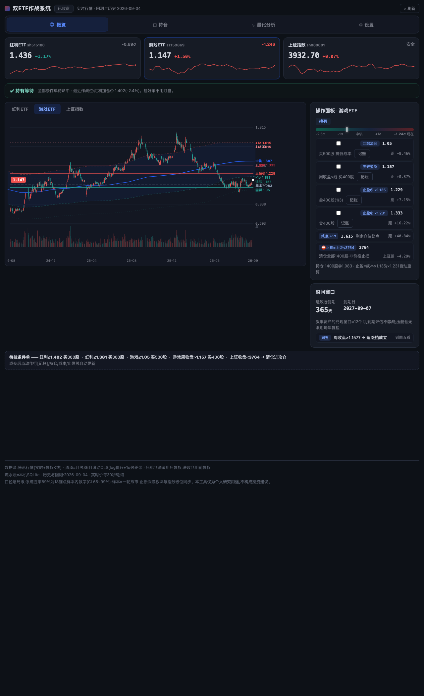
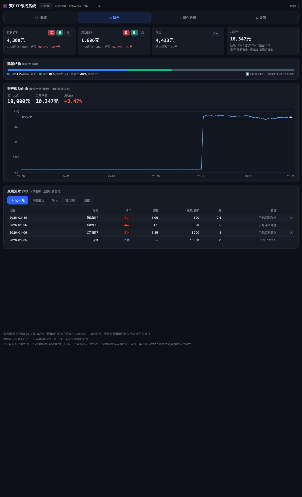
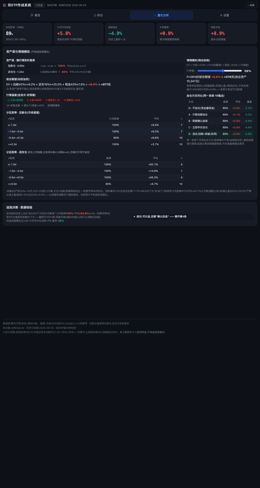
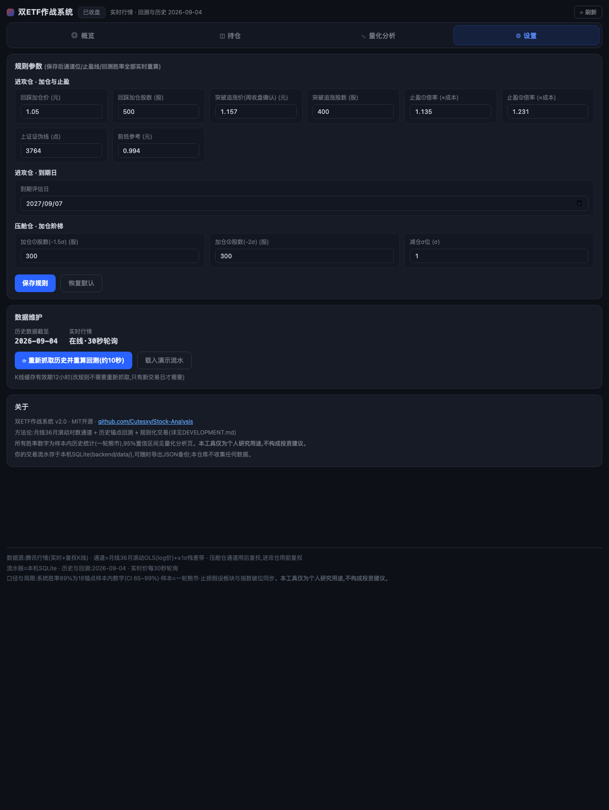

# Stock-Analysis · 双ETF量化作战系统

一个本地运行的个人投资决策工具:**月线滚动通道**定位买卖点、**历史锚点回测**量化胜率、**本地数据库**管理持仓。前后端分离(FastAPI + 原生ES模块),行情终端式界面——蜡烛图+成交量、报价条、中式红涨绿跌;手机浏览器打开可"添加到主屏幕"当独立APP用。

> ⚠️ 仅为个人研究工具,不构成投资建议。所有回测为样本内数字,样本=一轮熊市,置信区间见应用内。

## 界面

| 概览 · 决策卡与通道 | 持仓 · 仓位维护与收益曲线 |
|---|---|
|  |  |

| 量化分析 · 胜率三层 | 设置 · 规则参数 |
|---|---|
|  |  |

**四个页面**(桌面顶部导航/手机底部Tab):
- **概览**——三标的报价条(sparkline+σ位置)+ 一句话建议横幅 + 大图表(蜡烛/成交量/通道/作战位,点击报价卡切换标的) + 操作面板(作战位距离+一键记账) + 待挂条件单
- **持仓**——仓位卡(浮盈/加权成本/买卖息快捷键)+ 配置结构对比 + 账户收益曲线(流水逐日回放,净值vs累计入金)+ 交易流水(chip化动作)
- **量化分析**——胜率大数字卡(系统层/中段/尾段/最差)+ σ分区查表 + 五种加仓方式对比 + 追涨事件检验 + P(修复)情境滑块
- **设置**——规则参数可视化编辑(**保存即用新参数重算全部回测**)、数据维护、关于

## 快速开始

```bash
git clone https://github.com/Cutesxy/Stock-Analysis.git
cd Stock-Analysis
./run.sh          # 自动建venv、装依赖、启动,然后打开 http://localhost:8420
```

macOS 可直接双击 `启动.command`。首次启动约需10秒抓取历史数据。

**第一步做什么**:打开后点[载入演示数据]体验全部功能,清空后记自己的第一笔[入金]→[买入],持仓/止盈线/胜率全部自动联动。你的流水只存在本机SQLite,可随时导出JSON备份。

## 核心方法论(简版)

- **通道**:月收盘对数价、36个月滚动OLS、残差±1σ。滚动=无未来函数。σ位置=(log价−log中轨)/σ。红利用后复权(含分红再投),游戏用前复权。
- **压舱仓**(红利ETF):−1.5σ/−2σ阶梯加仓,+1σ减仓,无止损——分红+回归是收益来源。
- **进攻仓**(游戏ETF):**止损锚定上证指数而非板块价格**(剧本证伪线);止盈=加权成本×1.135/×1.231两档,档位=持仓1/3;持有约12个月到期评估。
- **胜率的来源是规则不是预测**:历史锚点组合模拟(沪深300≤−1σ月入场)给出系统胜率与95%CI;行情温度旗标+P(修复)滑块做情境自检。
- **规则可改**:设置页调整任何参数,回测立即按新规则重算——所见即所测。

## 项目结构

```
Stock-Analysis/
├── backend/               # FastAPI:行情/K线/通道/回测/SQLite流水/规则覆盖
├── frontend/
│   ├── js/views/          # 四个视图模块(概览/持仓/量化/设置)——解耦,互不依赖
│   ├── js/store.js        # 单一数据源+订阅通知
│   └── manifest+icons     # PWA(添加到主屏幕)
├── docs/screenshots/
├── DEVELOPMENT.md         # 开发文档:架构/API/功能清单/口径/局限/验证方法
└── run.sh / 启动.command
```

想了解完整的口径定义(锚点/E方案/同构事件/Clopper-Pearson区间)、已知局限(诚实清单)或二次开发指南,请读 [DEVELOPMENT.md](DEVELOPMENT.md)。

## 数据源

- 实时行情:腾讯 `qt.gtimg.cn`
- 历史K线:腾讯 `web.ifzq.gtimg.cn`(复权,自动翻页,本地双缓存)

## License

[MIT](LICENSE)
