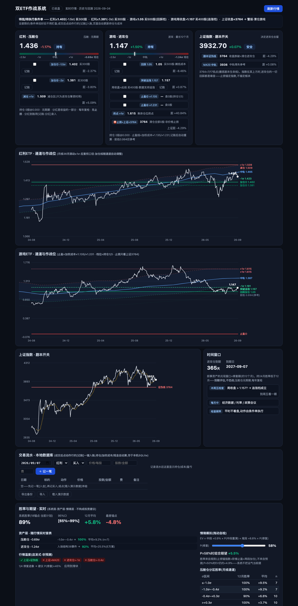

# Stock-Analysis · 双ETF量化作战系统

一个本地运行的个人投资决策工具:用**月线36月滚动通道**定位买点,用**历史锚点模拟**量化胜率,用**流水账数据库**管理真实持仓。前后端分离(FastAPI + 原生ES模块前端,零构建零npm依赖)。

> ⚠️ 仅为个人研究工具,不构成投资建议。所有回测为样本内数字,样本=一轮熊市。

## 功能特性

### 🎯 三张决策卡
- 实时价格 + σ位置仪表盘(通道中的位置一目了然)
- 每个动作的距离百分比(加仓线还差几个百分点)
- 触发高亮:接近/触及作战位时动作行自动变色

### 📈 通道图表(纯SVG实现,无图表库)
- K线价格走势 + 36月滚动对数回归通道带(±1σ/−2σ)+ 中轨
- 作战位横线自动碰撞避让标注,成本虚线,实时价脉冲点,悬停十字线

### 🧮 胜率体系(三层)
- **系统层**:19个历史锚点(沪深300≤−1σ月)组合模拟,含Clopper-Pearson置信区间
- **资产层**:实时σ位置→分区胜率查表(红利4区/游戏4区)
- **情境层**:P(修复)滑块 + 行情温度4旗标,自检不同市况下的期望收益

### 💾 交易流水·本地数据库(SQLite)
- 成交后点[记账]一键入账:持仓股数/移动加权成本/现金/已实现盈亏全自动
- 止盈线随加权成本**自动重算**,止盈档位=持仓的1/3自动缩放
- 买入/卖出/分红/入金全支持;JSON导出备份/导入

### 🚀 追涨决策模块
- 五种加仓方式的锚点对比(不加仓/只等回踩/突破追涨/立即加/混合)
- 低区突破事件单独检验(含"突破失败后仍胜率"与追涨后最大回撤)

## 快速开始

```bash
git clone git@github.com:Cutesxy/Stock-Analysis.git
cd Stock-Analysis

# 方式一:通用脚本(自动创建venv并装依赖)
./run.sh

# 方式二:macOS直接双击 启动.command

# 打开 http://localhost:8420
```

依赖:Python 3.10+(自动安装 fastapi/uvicorn/curl-cffi);首次启动约需10秒抓取历史数据。

## 截图

| 主视图(决策卡+通道图表) |
|---|
|  |

**使用流程**:
1. 打开页面 → 先在"交易流水"面板记一笔[入金](现金)
2. 记入实际买入(价格/股数) → 持仓/成本/止盈线自动更新
3. 按照决策卡的作战位在券商App挂条件单
4. 成交后回页面点[记账] → 一切自动重算

## 项目结构

```
Stock-Analysis/
├── backend/
│   ├── app.py              # FastAPI入口
│   ├── config.py           # 标的/规则/回测参数(全部可调)
│   ├── storage.py          # SQLite流水账
│   └── services/           # 行情/K线/通道/回测四个服务
├── frontend/
│   ├── index.html
│   ├── css/style.css
│   └── js/                 # app/channel/charts/ledger/api/config 六模块
├── docs/screenshots/       # 文档截图
├── DEVELOPMENT.md          # 开发文档(架构/口径/约定/局限)
├── run.sh / 启动.command    # 启动脚本
└── LICENSE                 # MIT
```

详见 [DEVELOPMENT.md](DEVELOPMENT.md):架构图、API设计、已实现功能清单、关键口径(改动前必读)、验证方法、已知局限。

## 核心方法论(简版)

**通道**:月收盘取对数,36个月滚动OLS回归,残差±1σ构成通道带。滚动计算=无未来函数。σ位置=(log价−log中轨)/σ,衡量当前在历史趋势中的相对位置。

**压舱仓逻辑**:红利ETF后复权通道,−1.5σ/−2σ阶梯加仓,+1σ减仓,无止损(分红是收益的一部分)。

**进攻仓逻辑(E方案)**:游戏ETF前复权通道深区买入;**止损锚定上证指数**(跌破磨底剧本生命线=清仓,不锚定板块自身价格);止盈=加权成本×1.135/×1.231两档(档位=持仓1/3);持有约12个月(叙事资产的兑现窗口)。

**胜率的来源**:不是预测,而是规则——历史19个锚点上,这套规则组合胜率约89%(95%CI 65~99%,一轮熊市样本内)。诚实地说:样本小,CI宽,别当真理。

## 数据源

- 实时行情:腾讯 `qt.gtimg.cn`
- 历史K线:腾讯 `web.ifzq.gtimg.cn`(复权处理,自动翻页)

## License

[MIT](LICENSE)
